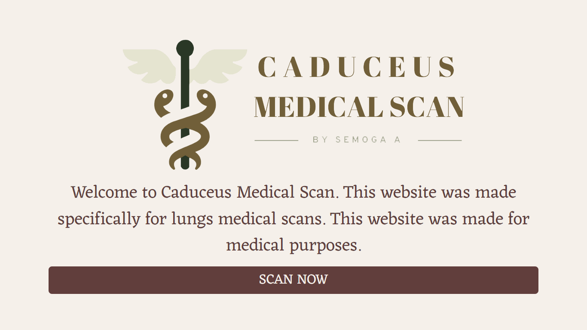
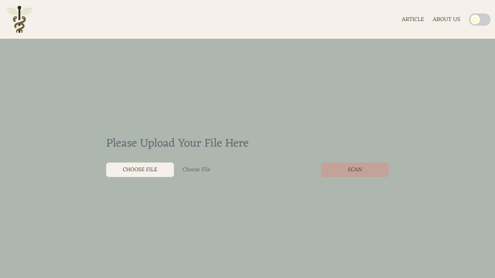
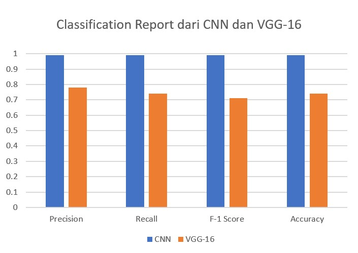
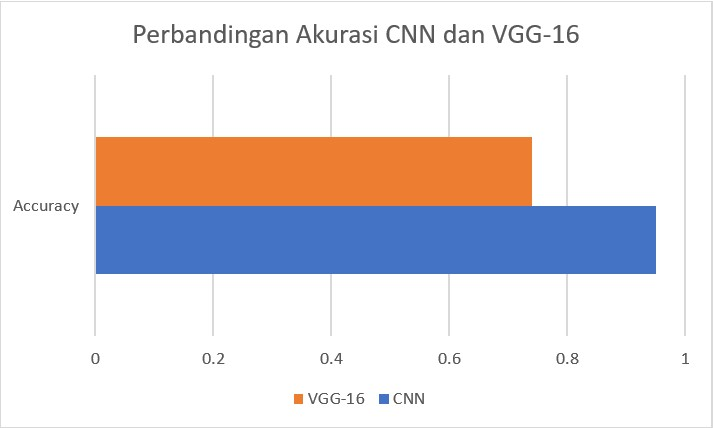

<h1>Final Project Pengolahan Citra Digital</h1>
  

Caduceus Medical Scan is a project that was made for medical scan purposes. This project was made to scan medical image like CT Scans, MRI, X-Ray, and so on. This project is using 2 types of model, CNN-based model and VGG-16 model. In this project, the Caduceus Medical Scan is specifically scan for lungs part. The machine will determine it into 3 different type of result. The first one is Covid, the second one is Normal, and the third one is Pneumonia. 

The dataset, model and also the presentation files can be found at :
<link>

This project used : 
  <ul>
    <li>
      Python:
      <ul>
        <li>opencv</li>
        <li>django</li>
        <li>pickle</li>
        <li>numpy</li>
        <li>tensorflow</li>
      </ul>
    </li>
    <li>
    CSS:
    <ul>
        <li>Bootstrap 5.1.3</li>
        <li>Fontawesome 4.7.0</li>
        <li>Google Font</li>
    </ul>
    </li>
    <li>
    Javascript:
    <ul>
        <li>JQuery 3.6.0</li>
    </ul>
    </li>
    <li>
    Database:
    <ul>
        <li>SQLite3</li>
    </ul>
    </li>
  </ul>
  
  

<h3>Snapshot:</h3>

<h3>Model Comparison:</h3>

  

   
  This image is CNN and VGG16 model comparison in classification report. There are four category that is being compared. Those are precision, recall, f-1 score and accuracy.

 

  

   
  This image is CNN and VGG16 model in term of accuracy.

