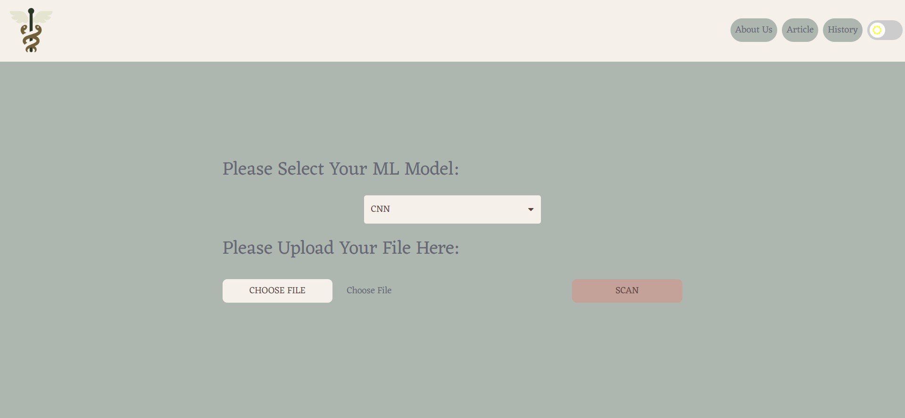

<h1>Final Project Pengolahan Citra Digital</h1>
  

  Caduceus Medical Scan is a project that was made for medical scan purposes. This project was made to scan medical image like CT Scans, MRI, X-Ray, and so on. This project is using 2 types of model, CNN-based model and VGG-16 model. In this project, the Caduceus Medical Scan is specifically scan for lungs part. The machine will determine it into 3 different type of result. The first one is Covid, the second one is Normal, and the third one is Pneumonia. 

  The dataset, model and also the presentation files can be found at :
   
  Dataset: <a href="https://drive.google.com/drive/folders/17h53ogv8hsLgYUe_NExgwIU6jUEq2eEg?usp=sharing">PCD Website Dataset</a>
   
  Model: <a href="https://drive.google.com/drive/folders/1SPhkDcL9GvEae5z34266yb4jppGMJeQo?usp=sharing">PCD Website Model</a>
   
  Presentation: <a href="https://docs.google.com/presentation/d/1p1ob4YlDwP9yhwEX9VPEIV4IM7kfrBCS/edit?usp=sharing&ouid=117273436821419590701&rtpof=true&sd=true">Team Presentation</a>
   
  Paper Refrence: <a href="https://ieeexplore.ieee.org/document/9183278">Deep Learning based Diagnosis Recommendation for COVID-19 using Chest X-Rays Images</a>
  
   
  Guide:
   
  Before you can use this project, download the CNN and VGG16 model inside Google Drive Folder in <b>PCD Website Model</b>'s link. After that, move the model file into pcdWebsite folder in your local repository (after you download or clone this project). Then you can use this project.

   
   
This project used : 
  <ul>
    <li>
      Python:
      <ul>
        <li>opencv</li>
        <li>django</li>
        <li>pickle</li>
        <li>numpy</li>
        <li>tensorflow</li>
      </ul>
    </li>
    <li>
    CSS:
    <ul>
        <li>Bootstrap 5.1.3</li>
        <li>Fontawesome 4.7.0</li>
        <li>Google Font</li>
    </ul>
    </li>
    <li>
    Javascript:
    <ul>
        <li>JQuery 3.6.0</li>
    </ul>
    </li>
    <li>
    Database:
    <ul>
        <li>SQLite3</li>
    </ul>
    </li>
  </ul>
  
  

<h3>Snapshot:</h3>

<h3>Model Comparison:</h3>

  

   
  This image is CNN and VGG-16 model comparison in classification report. There are four category that is being compared. Those are precision, recall, f-1 score and accuracy. Overall, CNN model is more adventageous than VGG-16 model.

 

  

   
  This image is CNN and VGG-16 model's comparison in term of accuracy.

